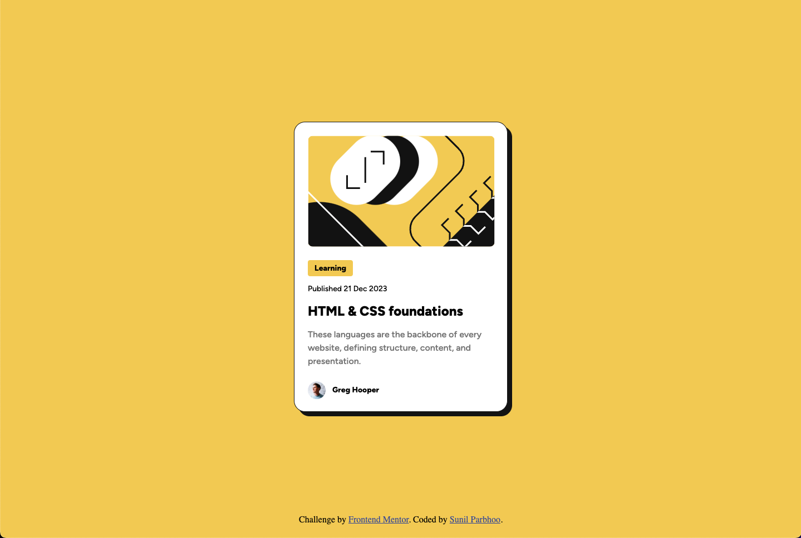

# Frontend Mentor - Blog preview card solution

This is a solution to the [Blog preview card challenge on Frontend Mentor](https://www.frontendmentor.io/challenges/blog-preview-card-ckPaj01IcS). Frontend Mentor challenges help you improve your coding skills by building realistic projects.

## Table of contents

- [Frontend Mentor - Blog preview card solution](#frontend-mentor---blog-preview-card-solution)
  - [Table of contents](#table-of-contents)
  - [Overview](#overview)
    - [The challenge](#the-challenge)
    - [Screenshot](#screenshot)
    - [Links](#links)
  - [My process](#my-process)
    - [Built with](#built-with)
    - [What I learned](#what-i-learned)
  - [Author](#author)

## Overview

### The challenge

Users should be able to:

- See hover and focus states for all interactive elements on the page

### Screenshot

### Links

- Solution URL: [Add solution URL here](https://your-solution-url.com)
- Live Site URL: [Add live site URL here](https://your-live-site-url.com)

## My process

This project was built using semantic HTML5 and CSS3. I chose to build this without additional frameworks in order to leverage and hone my CSS skills.

### Built with

- Semantic HTML5 markup
- CSS custom properties
- Flexbox

### What I learned

As my second FrontEnd Mentor project, I was proud to be able to continue to hone my base CSS skills, utilizing transitions and hover effects to accurately match the Figma designs. I focused more on utilizing semantic HTML, and paid more closer attention to finer details such as font-line height and box-shadows. Additionally, I utilized transitions to give the hover effects more of a smooth animation.

## Author

- GitHub - [Sunil Parbhoo](https://github.com/SunilParbhoo)
- Frontend Mentor - [@SunilParbhoo](https://www.frontendmentor.io/profile/SunilParbhoo)
